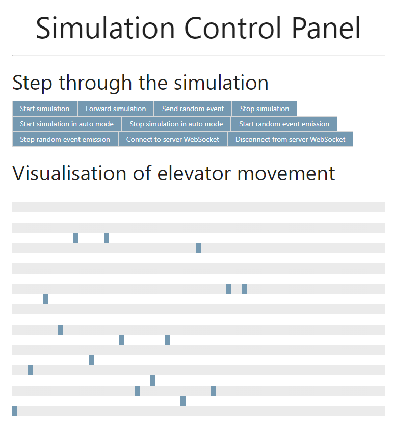
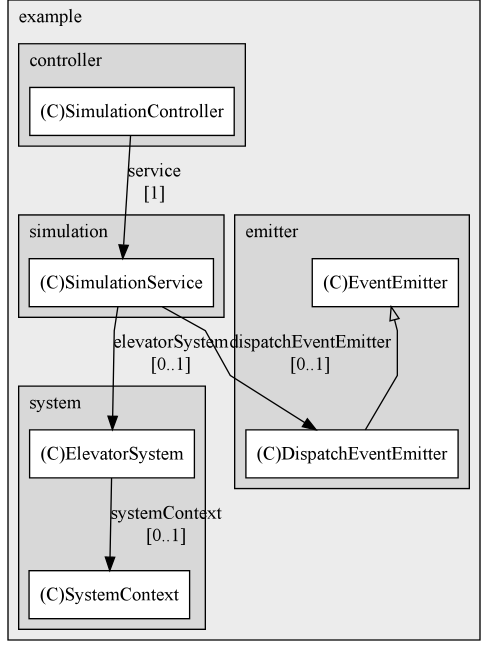

# Elevator System Simulator



Symulacja uproszczonego systemu wind zdolnego do symulacji do 16 wind.

<!-- Building -->
## Kompilacja

<!-- Building from source -->
### Kompilacja z kodu źródłowego
Aby zbudować aplikację, należy uruchomić w katalogu głównym:

```ssh
mvn clean package
```

<!-- Building the docker image -->
### Tworzenie obrazu Docker
1. W katalogu głównym uruchom `mvn clean package`
2. Następnie uruchom `docker build -t <reponame>/<image_name>:<chosen_tag> .`

<!-- Testing-->
## Testy

<!-- Running tests with Maven -->
### Uruchamianie testów

Aby uruchomić zestaw testów, w katalogu głównym należy użyć polecenia:

```bash
mvn test
```

<!-- Using postman -->
### Testowanie za pomocą Postmana

Aby uruchomić testy Postman, zaimportuj kolekcję `Elevator System.postman_collection.json` do aplikacji. Stamtąd można uruchamiać testy ręcznie lub za pomocą runnera. Jeśli port lub nazwa hosta różnią się od `localhost:8080`, należy odpowiednio zmodyfikować zmienne kolekcji.

<!-- Running the application -->
## Uruchamianie aplikacji

<!-- Running locally -->
### Lokalnie

Aby uruchomić aplikację, należy pobrać repozytorium i w katalogu głównym użyć polecenia:
```bash
mvn spring-boot:run
```

Aplikacja może zostać zatrzymana za pomocą  `CTRL+C`.

<!-- Running the container -->
### W kontenerze

1. Ściągnij obraz używając `docker image pull kapiaszczyk/elevator-system:latest`
2. Uruchom `docker run -p 8080:8080 kapiaszczyk/elevator-system:latest` aby uruchomić kontener

<!-- How to use the panel -->
## Obsługa

Symulacja może być kontrolowana bezpośrednio przez punkty końcowe (patrz "Punkty końcowe API") lub za pomocą panelu dostępnego pod adresem `hostname:port` (np. `http://localhost:8080`).

Symulacja może być uruchamiana w trybie manualnym lub automatycznym.

<!-- Manual mode -->
### Tryb manualny

W trybie ręcznym jeden krok symulacji jest równy jednemu przejazdowi wszystkich wind. Możliwe jest wyemitowanie zdarzenia losowego (wywołanie z losowego piętra lub wywołanie wewnątrz windy), wyemitowanie wywołania piętra z wybranymi szczegółami lub aktualizacja stanu wybranej windy. Można uruchomić emiter zdarzeń losowych, który będzie emitował zdarzenia automatycznie.

W trybie ręcznym dostępne są następujące operacje:
- rozpoczęcie/zatrzymanie symulacji
- symulacja do przodu (krok)
- emitowanie zdarzenia losowego
- emitowanie zdarzenia z wybranymi szczegółami (odbiór z piętra)
- aktualizacja stanu wybranej windy
- rozpoczęcie/zatrzymanie emisji zdarzenia losowego

<!-- Auto mode -->
### Tryb automatyczny

W trybie automatycznym symulacja działa samodzielnie i nie można jej ręcznie przekierować. Emiter zdarzeń losowych jest uruchomiony, symulując połączenia z systemem.

W trybie automatycznym dostępne są następujące operacje:
- uruchomienie/zatrzymanie symulacji w trybie automatycznym
- emitowanie zdarzenia losowego
- emitowanie zdarzenia z wybranymi szczegółami (odbiór z piętra)
- aktualizacja stanu wybranej windy

Panel umożliwia również połączenie z websocketem, co pozwala na dynamiczne pobieranie stanów wszystkich wind, które są również wizualizowane.

Stany mogą być również pobierane ręcznie.

<!-- API Endpoints -->
### Punkty końcowe API

| **Endpoint** | **Method** | **Description** |
| --- | --- | --- |
| `/api/v1/simulation/system/event` | *POST* | Emit a floor dispatch event. |
| `/api/v1/simulation/system/elevator/{id}/state/current-floor/{current}/destination-floor/{destination}` | *POST* | Update the state of an elevator. |
| `/api/v1/simulation/stop` | *POST* | Stop the simulation. |
| `/api/v1/simulation/stop-emitter` | *POST* | Stop the random event emitter. |
| `/api/v1/simulation/stop-auto` | *POST* | Stop the simulation in auto mode. |
| `/api/v1/simulation/start` | *POST* | Start the simulation. |
| `/api/v1/simulation/start-emitter` | *POST* | Start the random event emitter. |
| `/api/v1/simulation/start-auto` | *POST* | Start the simulation in auto mode. |
| `/api/v1/simulation/random-event` | *POST* | Emit a single random event. |
| `/api/v1/simulation/forward` | *POST* | Forward the simulation by one step. |
| `/api/v1/simulation/system/state` | *GET* | Get the current state of the simulation. |
| `/` | *GET* | Render the index page. |

*This table was generated from openAPI docs
using [this script](https://github.com/kapiaszczyk/python-scripts/blob/main/extract_openapi_paths.py)*.

<!-- Architectural choices, assumptions etc. -->
## Architektura

Aplikacja jest obsługiwana przez `Spring Web MVC` i `Spring Boot`, aby umożliwić łatwiejszą interakcję z symulacją. `SimulationService` jest warstwą usługową dla `SimulationController`, który z kolei obsługuje wywołania API.

W swoim rdzeniu `ElevatorSystem` działa jako scentralizowana fasada dla wszystkich interakcji. `SystemContext` przechowuje logikę biznesową i obiekty reprezentujące stan systemu.

Pojedynczy `ExternalDispatcher` jest subskrybowany do `EventBus`, który jest używany do emitowania zdarzeń do systemu. Dyspozytor jest odpowiedzialny za kierowanie zdarzeń do odpowiednich instancji `InternalDispatcher`, z których każda jest odpowiedzialna za obsługę zdarzenia w kontekście pojedynczej windy.

Każdy `Elevator` ma swój własny `InternalDispatcher` i obiekt `State`, który jest używany do przechowywania aktualnego stanu windy. Każda winda działa na własnym wątku. Wątki są chronione za pomocą blokady.

Każdy krok symulacji powiadamia wątki o przetworzeniu zadania - pojedynczego przejazdu windy. Po zakończeniu stan windy jest aktualizowany i ustawiany jako nieaktywny.

Funkcja `DispatchEventEmitter` jest odpowiedzialna za emitowanie losowych zdarzeń do systemu. Jest on uruchamiany w osobnym wątku i może być uruchamiany i zatrzymywany.



<!-- Used algorithms -->
### Algorytmy
Windy przetwarzają zdarzenia w trybie FIFO.

Takie podejście zapewnia, że wszystkie żądania zostaną ostatecznie przetworzone; nie gwarantuje to jednak najkrótszego czasu oczekiwania dla pasażerów i nie jest optymalne pod względem czasu podróży.

Ponadto windy są wysyłane do zdarzenia w kolejności ich identyfikatorów (round-robin). Takie podejście gwarantuje, że wszystkie żądania z pięter zostaną obsłużone.

<!-- Assumptions -->
### Założenia
- Windy nie mają limitu wagi
- Windy nie mają limitu wielkości kolejki.

<!-- Potential improvements -->
### Potencjalne ulepszenia
- W obecnej implementacji windy są wysyłane w sposób rotacyjny. Można to poprawić, stosując bardziej zoptymalizowany algorytm.
- Wszystkie żądania z pięter są wysyłane, nawet jeśli na danym piętrze znajduje się już winda. Można to poprawić, sprawdzając, czy winda jest już na danym piętrze, a jeśli tak, pozwalając tej windzie obsłużyć żądanie.
- Używane algorytmy nie wykorzystują informacji o kierunku żądań pięter.
- Można dodać funkcję zatrzymania awaryjnego.
