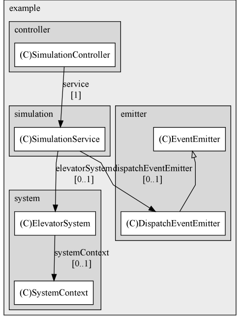

# Elevator System Simulator

Simulation of a simplified elevator system capable of simulating up to 16 elevators. For README in Polish, go to [PL_README.md](PL_README.md).

<!-- Requirements -->
## Requirements
- Java 21
- Maven
- optionally: Docker, Postman

<!-- Building -->
## Building

<!-- Building from source -->
### Building from source
To build the application, in the root directory, run:

```ssh
mvn clean package
```

<!-- Building the docker image -->
### Building the Docker image
1. In the root directory run `mvn clean package`
2. Run `docker build -t <reponame>/<image_name>:<chosen_tag> .`

<!-- Testing-->
## Testing

<!-- Running tests with Maven -->
### Running test suite

To run the test suite, in the root directory, use:

```bash
mvn test
```

<!-- Using postman -->
### Testing with Postman

To run Postman tests, import the `Elevator System.postman_collection.json` collection into the application. From there, you can run tests manually or using the runner. If your port or hostname different from `localhost:8080`, make sure to modify collection variables accordingly.

<!-- Running the application -->
## Running the application

<!-- Running locally -->
### Locally

To start the application, download the release package, and in the root directory, use:
```bash
mvn spring-boot:run
```

The application can be stopped with the `CTRL+C` interrupt.

<!-- Running the container -->
### In a container

1. Pull the image using `docker image kapiaszczyk/elevator-system:latest`
2. Run `docker run -p 8080:8080 kapiaszczyk/elevator-system:latest` to start a container

<!-- How to use the panel -->
## Usage


The simulation can be controlled either directly via the endpoints (see "API Endpoints") or using the panel available at `hostname:port` (eg. `http://localhost:8080`).

The simulation can be run in manual or automatic mode.

<!-- Manual mode -->
### Manual mode

In manual mode, one step of simulation is equal to one trip made by all elevators. It is possible to emit a random event (either a call from a random floor or a call inside an elevator), emit a floor call with chosen details, or update the state of a chosen elevator. A random event emitter can be started, which will emit events automatically.

In manual mode, the following operations are available:
- start/stop simulation
- forward simulation (step)
- emit random event
- emit event with chosen details (pickup from floor)
- update state of the chosen elevator
- start/stop random event emission

<!-- Auto mode -->
### Auto mode

In auto mode, the simulation runs on its own and cannot be manually forwarded. The random event emitter is running, simulating calls to the system.

In the automatic mode, the following operations are available:
- start/stop simulation in auto
- emit random event
- emit event with chosen details (pickup from floor)
- update state of the chosen elevator

The panel also enables connecting to a websocket, which allows for dynamic fetching of the states of all elevators, which is also visualized.

States can be fetched manually as well.

<!-- API Endpoints -->
### API Endpoints

| **Endpoint** | **Method** | **Description** |
| --- | --- | --- |
| `/api/v1/simulation/system/event` | *POST* | Emit a floor dispatch event. |
| `/api/v1/simulation/system/elevator/{id}/state/current-floor/{current}/destination-floor/{destination}` | *POST* | Update the state of an elevator. |
| `/api/v1/simulation/stop` | *POST* | Stop the simulation. |
| `/api/v1/simulation/stop-emitter` | *POST* | Stop the random event emitter. |
| `/api/v1/simulation/stop-auto` | *POST* | Stop the simulation in auto mode. |
| `/api/v1/simulation/start` | *POST* | Start the simulation. |
| `/api/v1/simulation/start-emitter` | *POST* | Start the random event emitter. |
| `/api/v1/simulation/start-auto` | *POST* | Start the simulation in auto mode. |
| `/api/v1/simulation/random-event` | *POST* | Emit a single random event. |
| `/api/v1/simulation/forward` | *POST* | Forward the simulation by one step. |
| `/api/v1/simulation/system/state` | *GET* | Get the current state of the simulation. |
| `/` | *GET* | Render the index page. |

*This table was generated from openAPI docs
using [this script](https://github.com/kapiaszczyk/python-scripts/blob/main/documentation_tools/extract_openapi_paths.py)*.

<!-- Architectural choices, assumptions etc. -->
## Architecture

The application is supported by `Spring Web MVC` and `Spring Boot` to allow for easier interaction with the simulation. The API is documented with openAPI, the documentation can be accessed via `http://localhost:8080/swagger-ui/index.html`.
`SimulationService` is the service layer for the `SimulationController`, which in turn handles the API calls.

At its core, the `ElevatorSystem` acts as the centralized facade for all the interactions. `SystemContext` holds the business logic and the objects representing the state of the system.

A single `ExternalDispatcher` is subscribed to `EventBus`, which is used to emit events to the system. The dispatcher is responsible for routing the events to the correct `InternalDispatcher` instances, each of which is responsible for handling the event in the context of a single elevator.

Each `Elevator` has its own `InternalDispatcher` and `State` object, which is used to store the current state of the elevator. Each elevator runs on its own thread. The threads are guarded with a lock.

Each step of the simulation notifies the threads to process a job - a single trip of the elevator. Upon completion, the state of the elevator is updated and it is set to be inactive.

The `DispatchEventEmitter` is responsible for emitting random events to the system. It is run in a separate thread and can be started and stopped.



<!-- Used algorithms -->
### Algorithms
The elevators process the events in a FIFO manner.

This approach ensures that all requests will be processed eventually; however, this does not guarantee the shortest waiting time for the passengers and is not optimal in terms of travel time.

Additionally, the elevators are dispatched to the event in the order of their ID (round-robin). This approach ensures that all requests from floors will be served.

<!-- Assumptions -->
### Assumptions
- The elevators do not have a weight limit
- The elevators do not have a queue size limit

<!-- Potential improvements -->
### Potential improvements
- As of current implementation, the elevators are dispatched in a round-robin manner. This can be improved by using a more optimized algorithm.
- All requests from floors are dispatched, even if there is an elevator already on the floor. This can be improved by checking if the elevator is already on the floor, and if it is, letting that elevator handle the request.
- Used algorithms do not leverage information about the direction of the floor requests.
- An emergency stop feature could be added.
